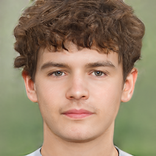

## 高橋 元について

**氏名**: 高橋 元

**職業**: ウェブデザイナー

おはようございます、ウェブデザイナーの高橋元です。
私の役割は、見た目だけではなく、ユーザビリティとアクセシビリティの観点からウェブサイトを設計し、最適なユーザ体験を提供することです。

私はコードを書き、デザインを考え、ウェブサイトを作成することが大好きで、それぞれのプロジェクトを新たな挑戦として捉えています。
求められる解決策を見つけることが得意で、自分が作ったデザインが他の人々の生活を豊かでより簡単なものに変えるのを見るのが喜びです。

**趣味**:

- 写真撮影
- ヨガ

**好きなこと**:

- 新しい技術を学ぶこと
- コーヒーを楽しむこと

素晴らしいアイデアを共有し、素晴らしいプロジェクトを一緒に創り上げていきましょう！

---

注意: 上記プロフィールはすべて架空のものであり、実際の人物とは一切関係ありません。
